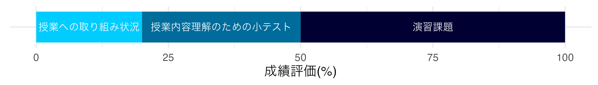

情報科学入門
==========

2023年度後期開講「情報科学入門」

ナンバリング: `INFO1010JLAS20`

## 授業の計画

| 週 | 内容     | 資料 |
|----|----------|------|
| 1 | ガイダンス | [`01_ガイダンス.pdf`](slide/01_ガイダンス.pdf) |
| 2 | 情報社会への理解 | [`02_情報社会への理解.pdf`](slide/02_情報社会への理解.pdf) |
| 3 | 情報社会を支える仕組みと特徴 | [`03_情報社会を支える仕組みと技術.pdf`](slide/03_情報社会を支える仕組みと技術.pdf) |
| 4 | 情報セキュリティ | [`04_情報セキュリティ.pdf`](slide/04_情報セキュリティ.pdf) |
| 5 | データサイエンス・AIの歴史 | [`05_データサイエンス・AIの歴史.pdf`](slide/05_データサイエンス・AIの歴史.pdf) |
| 6 | AI活用の現状と展望 | |
| 7 | プログラミング基礎 | [`07_プログラミング基礎.pdf`](slide/07_プログラミング基礎.pdf) |
| 8 | データの記述 | |
| 9 | データの可視化 | |
| 10 | データの関係性 | |
| 11 | プログラミング演習 | |
| 12 | レポート作成 | |
| 13 | プログラミング応用 | |
| 14 | プレゼンテーション1 | |
| 15 | プレゼンテーション2 | |

## 成績評価の方法

